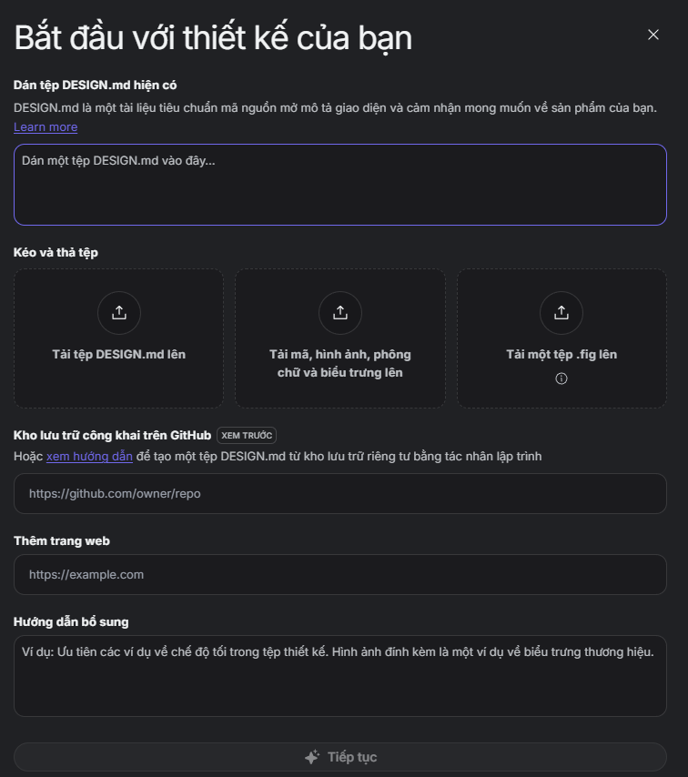

# 🚗 ANPR Sentry Tactical — Real-Time License Plate Recognition & Surveillance

<p align="left">
  <a href="#-ci-cd-pipeline">
    
  </a>
  <a href="#-tech-stack">
    
  </a>
  <a href="#-tech-stack">
    
  </a>
  <a href="#-tech-stack">
    
  </a>
  <a href="#-tech-stack">
    
  </a>
  <a href="#-docker-compose-deployment">
    
  </a>
  <a href="#-testing--code-quality">
    
  </a>
  <a href="#-testing--code-quality">
    
  </a>
  <a href="#-license">
    
  </a>
</p>

> **High-throughput, edge-optimized Automatic Number Plate Recognition (ANPR/ALPR) and intelligent traffic surveillance platform.**  
> Completely modernizes legacy, fragile OpenCV thresholding and heuristic OCR into a high-performance system powered by **TensorRT FP16 acceleration (<3ms)**, **ByteTrack multi-object tracking**, an adaptive **Laplacian/Scale Best-Frame Selector**, and **Dual Recognition Engines (PaddleOCR & Fine-Tuned 4-bit Qwen2-VL)** with real-time **Security Watchlist Alerting** and an interactive cyber-dark command dashboard.

---

## 📸 Demo & Screenshots

| Mission-Control Command Dashboard (`http://localhost:8000`) | Tactical HUD Video Overlay & Stolen Vehicle Interception |
| :---: | :---: |
|  |  |

---

## ⚡ Core Features

- **Sub-3ms TensorRT Inference:** YOLOv8n vehicle & plate detection compiled with TensorRT FP16 (200+ FPS throughput).
- **Persistent ByteTrack Tracking:** Multi-object tracking across occlusions with 4D trajectory linear interpolation gap-filling.
- **Adaptive Best-Frame Selector:** Pools candidate crops using Laplacian variance (sharpness) and pixel area, cutting recognition compute by **>95%**.
- **Dual Modular OCR/VLM Engines:**
  - **PaddleOCR (PP-OCRv6):** Ultra-fast lightweight inference (~25ms).
  - **Qwen2-VL-2B (QLoRA 4-bit):** SOTA multi-modal vision-language recognition achieving **80.8% Exact Match** on raw RGB crops without thresholding.
- **Real-Time Security Watchlist:** Instant interception of stolen vehicles (`CRITICAL`) and toll violators (`WARNING`) with database auditing.
- **Modern Tactical Web Dashboard:** FastAPI backend with cyber-dark obsidian glassmorphism, real-time telemetry, and sample testing gallery.
- **Production CI/CD & Docker:** GitHub Actions pipeline (Pylint 10/10 & Pytest 19/19) with one-click Docker Compose GPU deployment.

---

## 🏗️ Architecture & Tech Stack

```mermaid
flowchart LR
    %% Academic Pipeline Architecture - Clean & High Contrast
    classDef default fill:#f8fafc,stroke:#334155,stroke-width:1.5px,color:#0f172a;
    classDef core fill:#eff6ff,stroke:#2563eb,stroke-width:1.8px,color:#1e40af;
    classDef opt fill:#fef3c7,stroke:#d97706,stroke-width:1.8px,color:#92400e;

    IN["Input Video Stream / Image Frame"]:::default

    subgraph DET ["1. Detection Stage"]
        VD["Vehicle Detection\n(YOLOv8)"]:::core
        LD["License Plate Detection\n(YOLOv8)"]:::core
    end

    subgraph TRK ["2. Tracking & Association"]
        TRACK["Multi-Object Tracking\n(ByteTrack)"]:::default
        MATCH["Spatial Association\n(Plate-to-Vehicle)"]:::default
        BEST["Best-Frame Selector\n(Laplacian + Scale)"]:::opt
    end

    subgraph REC ["3. Recognition Stage"]
        OCR["Character Recognition\n(PaddleOCR / Qwen2-VL)"]:::core
        POST["Post-Processing & Validation\n(Regex & Normalization)"]:::default
    end

    OUT["Output & Telemetry\n(Database / Alerts / HUD Video)"]:::default

    %% Dataflow Connections
    IN --> VD
    IN --> LD
    VD -->|Vehicle BBoxes| TRACK
    TRACK -->|Track ID & Trajectory| MATCH
    LD -->|Plate BBoxes| MATCH
    MATCH -->|Candidate Crops| BEST
    BEST -->|Optimal Crop| OCR
    OCR -->|Raw Text| POST
    POST -->|Verified Plate| OUT
```



### 🔄 Pipeline Stage Breakdown

1. **Detection Stage (Parallel TensorRT FP16 Inferences):**
   - **Vehicle Detection (`yolov8n.engine` - 2.4ms):** Identifies vehicle bounding boxes $[x_1, y_1, x_2, y_2, \text{conf}, \text{cls}]$ across 4 vehicle classes (Car, Bus, Truck, Motorcycle).
   - **Plate Detection (`license_plate_detector.engine` - 2.7ms):** High-precision localized bounding box extraction targeting the license plate region.
2. **Tracking & Association Stage:**
   - **Multi-Object Tracking (ByteTrack):** Applies Kalman filtering and two-stage Hungarian association to track vehicles through occlusions with persistent track IDs.
   - **Spatial Association:** Maps plate boxes to parent vehicles via spatial containment and Intersection-over-Plate ($\text{IoP} \ge 0.85$).
   - **Adaptive Best-Frame Selector:** Pools candidate plate crops over the vehicle's trajectory and evaluates sharpness and resolution:
     $$\text{Score} = \text{Confidence} \times \sqrt{\text{Area}} \times \ln(1 + \text{Var}(\nabla^2 I))$$
     Aggressively filters motion blur and selects **exactly 1 optimal crop per vehicle**, reducing downstream OCR compute by **>95%**.
3. **Recognition Stage (Raw RGB Crops):**
   - **Dual Recognition Engine:**
     - *Fast Mode:* **PaddleOCR (PP-OCRv6)** delivers lightweight character recognition in **~25ms**.
     - *SOTA Mode:* **Fine-Tuned Qwen2-VL-2B (QLoRA 4-bit)** delivers **80.8% Exact Match** accuracy on raw RGB crops without destructive binary thresholding.
   - **Post-Processing & Validation:** Regex normalization against UK Standard format (`^[A-Z]{2}[0-9]{2}[A-Z]{3}$`) with generic fallback (`^[A-Z0-9]{4,10}$`) and LLM markdown/prefix stripping.
4. **Output & Telemetry Stage:**
   - **Database & Edge Storage:** SQLAlchemy ORM persists detection events to SQLite (`data/anpr.db`) / PostgreSQL with date-partitioned WebP image storage (~1.5 KB/plate).
   - **Security Watchlist Interceptor:** Real-time flagging of stolen vehicles (`CRITICAL`) or toll violators (`WARNING`).
   - **Presentation:** Real-time FastAPI Tactical Dashboard (`http://localhost:8000`) and 4D trajectory-interpolated HUD video rendering.

### Tech Stack

| Component | Technologies |
| :--- | :--- |
| **Vision & Acceleration** | NVIDIA TensorRT 11.3 (FP16), PyTorch 2.4, Ultralytics YOLOv8, OpenCV |
| **Object Tracking** | ByteTrack, SciPy (4D Linear Spline Interpolation) |
| **Character Recognition** | Qwen2-VL-2B (4-bit BitsAndBytes QLoRA), PaddleOCR (PP-OCRv6) |
| **Backend & Dashboard** | FastAPI, Uvicorn, Jinja2, Vanilla CSS (Obsidian Glassmorphism) |
| **Database & Storage** | SQLAlchemy 2.0 (SQLite / PostgreSQL), WebP Lossless Storage |
| **DevOps & Testing** | Docker, Docker Compose, GitHub Actions, Pylint, PyTest |

---

## 🚀 Quick Start (Installation)

### Option A: Local Installation (Recommended for Development)

```bash
# 1. Clone repository
git clone https://github.com/BaoNguyenz/Automatic-number-plate-recognition.git
cd "Automatic-number-plate-recognition"

# 2. Create and activate conda environment
conda create -n anpr python=3.10 -y
conda activate anpr

# 3. Install PyTorch with CUDA 12.4
pip install torch torchvision --index-url https://download.pytorch.org/whl/cu124

# 4. Install dependencies
pip install -r requirements.txt
```

### Option B: Docker Compose (One-Click GPU Deployment)

```bash
# Build and start container with NVIDIA GPU passthrough
docker compose up -d

# Check live logs
docker compose logs -f
```

---

## 💻 Usage

### 1. Launch the Mission-Control Web Dashboard

```bash
python -m uvicorn src.api.app:app --host 0.0.0.0 --port 8000 --reload
```
Navigate to **`http://localhost:8000`** in your browser.

---

### 2. Run Video Stream Inference Pipeline (CLI)

```bash
# Run with PaddleOCR Engine (Fastest)
python scripts/run_pipeline.py --engine paddleocr --video 2103099-uhd_3840_2160_30fps.mp4

# Run with Fine-Tuned Qwen2-VL VLM Engine (Highest Accuracy)
python scripts/run_pipeline.py --engine qwen2_vl --video 2103099-uhd_3840_2160_30fps.mp4

# Quick test on first 300 frames
python scripts/run_pipeline.py --max-frames 300
```

---

### 3. RESTful API Examples

#### A. Recognize License Plate from Image
```bash
curl -X POST "http://localhost:8000/api/recognize" \
     -H "accept: application/json" \
     -F "file=@benchmark_crops/car_1701_SC56DYP_0.71.jpg"
```
**Sample JSON Response:**
```json
{
  "total_vehicles": 1,
  "detections": [
    {
      "vehicle_id": 1,
      "plate_number": "SC56DYP",
      "confidence": 0.985,
      "is_valid_format": true,
      "is_uk_format": true,
      "is_watchlist_match": true,
      "watchlist_reason": "Stolen vehicle report #ST-9921",
      "alert_level": "CRITICAL"
    }
  ],
  "engine_used": "paddleocr",
  "inference_time_ms": 28.4
}
```

#### B. Query System Health & Telemetry
```bash
curl -X GET "http://localhost:8000/api/system/status"
```
```json
{
  "status": "online",
  "device": "NVIDIA GeForce RTX 3060",
  "active_engine": "paddleocr",
  "total_detections": 142,
  "watchlist_hits": 8
}
```

---

## ⚙️ Configuration

Key settings can be modified in [`config/config.yaml`](file:///e:/LET_ME_COOK/Automatic%20number%20plate%20recognition/config/config.yaml) or via environment variables:

```yaml
# Hardware & Vision Engines
device: "cuda:0"
use_tensorrt: true
yolo_vehicle_engine: "Weight/yolov8n.engine"
yolo_plate_engine: "Licence_plate_detection/license_plate_detector.engine"

# Tracking & Quality Selection
conf_threshold: 0.35
iou_threshold: 0.45
laplacian_blur_threshold: 45.0
min_plate_area: 1200

# Recognition Engine & Database
recognition_engine: "paddleocr"    # Options: "paddleocr" | "qwen2_vl"
database_url: "sqlite:///data/anpr.db"
storage_dir: "media/plates"
```

---

## 📂 Project Directory Structure

```text
Automatic-number-plate-recognition/
├── .github/workflows/
│   └── ci.yml                    # Unified CI/CD Pipeline (Pylint, PyTest, GHCR Delivery)
├── config/
│   └── config.yaml               # System parameters & thresholds
├── docs/assets/                  # Dashboard screenshots & diagrams
├── src/
│   ├── api/
│   │   ├── app.py                # FastAPI server & REST API endpoints
│   │   ├── templates/            # Cyber-dark HTML5 Dashboard UI
│   │   └── static/               # CSS Design System & JavaScript
│   ├── database/
│   │   ├── models.py             # SQLAlchemy models (VehicleDetection & Watchlist)
│   │   └── connection.py         # Thread-safe session factory & auto-seeder
│   ├── vision/
│   │   ├── detector.py           # TensorRT FP16 detector with PyTorch fallback
│   │   └── tracker.py            # ByteTrack & Laplacian Best-Frame Selector
│   ├── recognition/
│   │   ├── paddle_engine.py      # Lightweight PaddleOCR (PP-OCRv6) Engine
│   │   ├── qwen2_vl_engine.py    # 4-bit Qwen2-VL Engine with QLoRA Adapter
│   │   └── postprocessor.py      # Regex cleaning & UK format validation
│   └── utils/
│       ├── interpolator.py       # Trajectory linear interpolator (gap-filling)
│       ├── storage.py            # WebP date-partitioned storage manager
│       └── visualizer.py         # Corner-accent bounding boxes & HUD overlay
├── scripts/
│   ├── run_pipeline.py           # Master video processing pipeline
│   ├── export_tensorrt.py        # ONNX to TensorRT engine builder
│   ├── finetune_qwen2_vl.py      # 4-bit QLoRA fine-tuning script
│   └── benchmark_paddleocr.py    # 26-crop benchmark evaluator
├── tests/                        # PyTest Unit & Integration test suite (19 tests)
├── benchmark_crops/              # Labeled 4K surveillance evaluation crops
├── Dockerfile                    # Production CUDA 12.4 Docker container
└── docker-compose.yml            # Multi-service container orchestration
```

---

## 📊 Benchmark & Evaluation Results

Evaluated on **26 challenging real-world crops** extracted from 4K traffic surveillance footage (extreme angles, motion blur, nighttime glare, and low contrast):

| Recognition Engine | Preprocessing Method | Exact Match (%) | Character Accuracy (%) | Average Latency | Peak VRAM |
| :--- | :--- | :---: | :---: | :---: | :---: |
| **EasyOCR (Baseline)** | Grayscale + Binary Thresholding | **15.4%** (4/26) | 71.2% | 36.1 ms | ~0.8 GB |
| **PaddleOCR (PP-OCRv6)** ⚡ | **Raw RGB (Adaptive Predictor)** | **34.6%** (9/26) | **86.2%** | **24.8 ms** | **~0.6 GB** |
| **Qwen2-VL-2B (Zero-Shot)** | Raw RGB Crop | **57.7%** (15/26) | 90.7% | 257.6 ms | **1.44 GB** |
| **Qwen2-VL-2B (QLoRA 4-bit)** 🔥 | **Raw RGB Crop (Fine-Tuned)** | **80.8%** (21/26) | **96.7%** | **380.4 ms** | **1.50 GB** |

> [!NOTE]
> **Key Insight:** Rigid binary thresholding degrades stroke edges and confuses visually similar characters (`0` vs `O`, `6` vs `G`, `5` vs `S`). Feeding raw RGB crops into modern deep learning models (PaddleOCR / Qwen2-VL) yields a **+65.4% exact match improvement**.

---

## 🧪 Testing & Code Quality

```bash
# Run complete test suite (19 unit & integration tests)
pytest tests/ -v

# Run Pylint static analysis (Rated 10.00/10)
pylint src/ --rcfile=.pylintrc
```

---

## 🤝 Contributing & License

1. Fork the Project & create your Feature Branch (`git checkout -b feature/AmazingFeature`)
2. Commit your Changes (`git commit -m 'feat: Add AmazingFeature'`)
3. Ensure all tests and linter pass (`pytest tests/ && pylint src/ --rcfile=.pylintrc`)
4. Push to the Branch (`git push origin feature/AmazingFeature`)
5. Open a Pull Request to `develop`

Distributed under the **MIT License**. See `LICENSE` for more information.