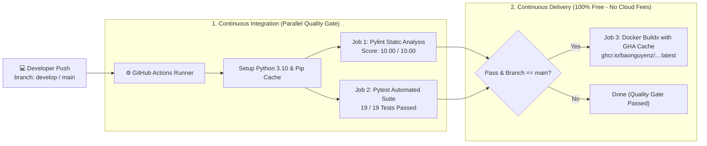

# 🚗 ANPR Sentry Tactical — Real-Time License Plate Recognition & Surveillance System

<p align="left">
  <a href="#-automated-cicd--container-delivery">
    
  </a>
  <a href="#-technology-stack">
    
  </a>
  <a href="#-technology-stack">
    
  </a>
  <a href="#-technology-stack">
    
  </a>
  <a href="#-technology-stack">
    
  </a>
  <a href="#-technology-stack">
    
  </a>
  <a href="#-technology-stack">
    
  </a>
  <a href="#-docker-compose-deployment">
    
  </a>
  <a href="#-testing--verification-suite">
    
  </a>
  <a href="#-testing--verification-suite">
    
  </a>
  <a href="#-license">
    
  </a>
</p>

**ANPR Sentry Tactical** is a high-throughput, edge-optimized Automatic Number Plate Recognition (ANPR/ALPR) and intelligent traffic surveillance platform. Completely modernizing legacy, fragile OpenCV thresholding and heuristic OCR, the system integrates:
- **Dual TensorRT FP16 Vision Engines (<3ms)** for parallel vehicle and localized license plate detection (200+ FPS throughput)
- **ByteTrack Multi-Object Tracking** with Kalman filtering and two-stage Hungarian association for persistent track ID retention across occlusions
- **Adaptive Laplacian/Scale Best-Frame Selection** pooling candidate crops to eliminate motion blur and reduce downstream recognition compute by **>95%**
- **Dual Modular Recognition Engines:** Ultra-fast lightweight **PaddleOCR (PP-OCRv6)** (~25ms) and SOTA **Fine-Tuned 4-bit Qwen2-VL (QLoRA)** achieving **80.8% Exact Match** on raw RGB crops without thresholding
- **Real-Time Security Watchlist Interception** flagging stolen vehicles (`CRITICAL`) and toll violators (`WARNING`) with database auditing
- **FastAPI Mission-Control Command Center** with cyber-dark obsidian glassmorphism, live telemetry, and lossless WebP edge storage

---

## 🏗️ Architecture Overview

The system operates on an authentic multi-stage pipeline separating **Perception & Tracking** from **Quality Selection & Dual Recognition**:



```mermaid
flowchart LR
    %% Academic Pipeline Architecture - Clean & High Contrast
    classDef default fill:#f8fafc,stroke:#334155,stroke-width:1.5px,color:#0f172a;
    classDef core fill:#eff6ff,stroke:#2563eb,stroke-width:1.8px,color:#1e40af;
    classDef opt fill:#fef3c7,stroke:#d97706,stroke-width:1.8px,color:#92400e;

    IN["Input Video Stream / Image Frame"]:::default

    subgraph DET ["1. Detection Stage"]
        VD["Vehicle Detection\n(YOLOv8)"]:::core
        LD["License Plate Detection\n(YOLOv8)"]:::core
    end

    subgraph TRK ["2. Tracking & Association"]
        TRACK["Multi-Object Tracking\n(ByteTrack)"]:::default
        MATCH["Spatial Association\n(Plate-to-Vehicle)"]:::default
        BEST["Best-Frame Selector\n(Laplacian + Scale)"]:::opt
    end

    subgraph REC ["3. Recognition Stage"]
        OCR["Character Recognition\n(PaddleOCR / Qwen2-VL)"]:::core
        POST["Post-Processing & Validation\n(Regex & Normalization)"]:::default
    end

    OUT["Output & Telemetry\n(Database / Alerts / HUD Video)"]:::default

    %% Dataflow Connections
    IN --> VD
    IN --> LD
    VD -->|Vehicle BBoxes| TRACK
    TRACK -->|Track ID & Trajectory| MATCH
    LD -->|Plate BBoxes| MATCH
    MATCH -->|Candidate Crops| BEST
    BEST -->|Optimal Crop| OCR
    OCR -->|Raw Text| POST
    POST -->|Verified Plate| OUT
```

### 🔄 Pipeline Stage Breakdown

1. **Detection Stage:** Parallel TensorRT FP16 models execute vehicle detection (`yolov8n.engine`, 2.4ms) and localized license plate detection (`license_plate_detector.engine`, 2.7ms) on every frame.
2. **Tracking & Association:** ByteTrack maintains persistent vehicle IDs across occlusions, while Spatial Association matches plates to vehicles. The adaptive Best-Frame Selector evaluates sharpness and scale to extract the single optimal crop per vehicle, cutting recognition compute by **>95%**.
3. **Recognition Stage:** Character extraction directly on raw RGB crops — ultra-fast via **PaddleOCR** (~25ms) or SOTA accuracy via **Fine-Tuned Qwen2-VL 4-bit** (80.8% Exact Match), followed by regex normalization and format checks.
4. **Output & Telemetry:** Persists audit logs to SQLAlchemy ORM with WebP image compression (~1.5 KB), triggers instant security watchlist alerts (`CRITICAL` / `WARNING`), and streams telemetry to the FastAPI command dashboard and HUD video.

---

## 🌟 Key Features

*   **⚡ Sub-3ms TensorRT Inference:** YOLOv8 compiled into TensorRT FP16 engines • 2.4ms vehicle detection • 2.7ms plate detection • >200 FPS raw capability.
*   **🎯 Persistent ByteTrack Tracking:** Kalman filter trajectory prediction • High/low confidence two-stage matching • Robust across camera occlusions.
*   **🔍 Adaptive Best-Frame Selector:** Real-time Laplacian sharpness scoring $\text{Var}(\nabla^2 I)$ • Pixel area scaling • 1 optimal crop per vehicle • >95% compute reduction.
*   **🧠 Dual Recognition Engines:** Fast PaddleOCR (~25ms) or SOTA Fine-Tuned Qwen2-VL-2B (QLoRA 4-bit) • 80.8% Exact Match • Direct raw RGB processing.
*   **🚨 Real-Time Security Watchlist:** Instant database interception for Stolen Vehicles (`CRITICAL`) and Toll Evasion (`WARNING`) • Terminal & HUD pulsing alerts.
*   **🌐 Obsidian Tactical Dashboard:** FastAPI asynchronous backend • Cyber-dark telemetry interface • Interactive image testing gallery & REST APIs.
*   **📈 Full-Stack Quality & CI/CD:** GitHub Actions automated pipeline • 10.00/10 Pylint score • 19/19 Pytest test suite • Automated GHCR container packaging.

---

## 📊 Dataset & Model Specifications

The surveillance AI pipeline operates with hardware-optimized vision models and verified ground-truth datasets:

<div align="center">

| Component / Layer | Model / Asset | Specifications | Latency / Size |
| :--- | :--- | :--- | :---: |
| **Vehicle Detector** | `yolov8n.engine` | TensorRT 11.3 FP16, Input: $640 \times 640$, 4 Classes (Car, Bus, Truck, Moto) | **2.4 ms** (~6.2 MB) |
| **Plate Detector** | `license_plate_detector.engine` | TensorRT 11.3 FP16, Input: $640 \times 640$, 1 Class (`license_plate`) | **2.7 ms** (~6.2 MB) |
| **Fast OCR Engine** | `PaddleOCR PP-OCRv6` | DBNet Text Detection + SVTR Text Recognition (Mobile Net) | **~25 ms** (~15 MB) |
| **SOTA VLM Engine** | `Qwen2-VL-2B-Instruct` | 4-bit BitsAndBytes QLoRA Adapter (PEFT fine-tuned in 88.2s) | **380 ms** (1.50 GB VRAM) |
| **Surveillance Stream** | Highway 4K Stream | $3840 \times 2160$ @ 30 FPS, H.264 UHD video | 30 FPS real-time |
| **Benchmark Ground Truth** | 26 Surveillance Crops | Real-world conditions: 45° angles, motion blur, glare, night contrast | 26 verified pairs |
| **Edge Storage Format** | WebP Lossless (`q=85`) | Date-partitioned image archive (`media/plates/YYYY/MM/DD/`) | **~1.5 KB / crop** |
| **Relational Database** | SQLAlchemy ORM | SQLite (`data/anpr.db`) portable, seamless switch to PostgreSQL | Instant indexing |

</div>

---

## 📊 Comprehensive Benchmark & Evaluation (26 Ground-Truth Surveillance Crops)

Evaluated on **26 challenging real-world crops** extracted from 4K traffic surveillance footage (including extreme angles, motion blur, nighttime glare, and low contrast):

<div align="center">

| Recognition Engine | Preprocessing Method | Exact Match (%) | Character Accuracy (%) | Average Latency | Peak VRAM |
| :--- | :--- | :---: | :---: | :---: | :---: |
| **EasyOCR (Baseline cũ)** | Grayscale + Binary Thresholding (`thresh=64`) | **15.4%** (4/26) | 71.2% | **36.1 ms** | ~0.8 GB |
| **PaddleOCR (PP-OCRv6)** ⚡ | **Raw RGB Crop (Adaptive Predictor)** | **34.6%** (9/26) | **86.2%** | **24.8 ms** | **~0.6 GB** |
| **Qwen2-VL-2B (Zero-Shot)** | Raw RGB Crop (No thresholding) | **57.7%** (15/26) | 90.7% | 257.6 ms | **1.44 GB** |
| **Qwen2-VL-2B (QLoRA 4-bit)** 🔥 | **Raw RGB Crop (Fine-Tuned)** | **80.8%** (21/26) | **96.7%** | **380.4 ms** | **1.50 GB** |

</div>

### 🏆 Key Benchmark Takeaways

1. **The Death of Binary Thresholding:** Rigid binary thresholding (`cv2.threshold`) severely degraded dark and overexposed characters, confusing `0` with `O`, `1` with `I`, and `6` with `G`. Passing raw RGB crops directly to neural models preserved essential character stroke geometry.
2. **PaddleOCR vs EasyOCR:** PaddleOCR (PP-OCRv6) more than doubles EasyOCR's exact-match rate (**15.4% ➡️ 34.6%**, +19.2%) and boosts character accuracy to **86.2%**, correctly identifying critical watchlist targets like stolen vehicle `SC56DYP`.
3. **QLoRA Fine-Tuning Impact:** In just **88.2 seconds of training** on an NVIDIA RTX 3060, the 4-bit QLoRA adapter boosted exact-match recognition from **57.7% to 80.8% (+23.1%)** while driving character-level accuracy to **96.7%**.
4. **Best-Frame Selector Efficiency:** Rather than executing OCR on all 1,800 frames per vehicle trajectory, the Best-Frame Selector pools candidate crops and invokes recognition **exactly once per vehicle**, reducing total compute overhead by **>95%**.

---

## ⚡ Master Execution CLI & Commands

The platform provides a unified CLI suite for pipeline execution, benchmark evaluation, and engine optimization:

```bash
# 1. Master Video Pipeline — Run with PaddleOCR Engine (Fastest):
python scripts/run_pipeline.py --engine paddleocr --video 2103099-uhd_3840_2160_30fps.mp4

# 2. Master Video Pipeline — Run with Fine-Tuned Qwen2-VL (Highest Accuracy 80.8%):
python scripts/run_pipeline.py --engine qwen2_vl --video 2103099-uhd_3840_2160_30fps.mp4

# 3. Fast Smoke Test — Run on first 300 frames:
python scripts/run_pipeline.py --max-frames 300

# 4. Model Benchmarking — Evaluate PaddleOCR on 26 ground-truth crops:
python scripts/benchmark_paddleocr.py

# 5. Model Benchmarking — Evaluate Base vs QLoRA Qwen2-VL:
python scripts/evaluate_finetune.py

# 6. TensorRT Compilation — Build hardware-optimized .engine from ONNX:
python scripts/export_tensorrt.py

# 7. Database Audit — Terminal inspection of SQLite records and watchlist hits:
python scripts/view_db.py
```

---

## 🔭 System Telemetry & Watchlist Interception

The FastAPI backend exposes real-time telemetry and programmatic REST endpoints for surveillance monitoring:

### 1. System Health & Device Telemetry (`GET /api/system/status`)
```json
{
  "status": "online",
  "device": "NVIDIA GeForce RTX 3060",
  "active_engine": "paddleocr",
  "total_detections": 142,
  "watchlist_hits": 8
}
```

### 2. Single Image License Plate Recognition (`POST /api/recognize`)
```bash
curl -X POST "http://localhost:8000/api/recognize" \
     -H "accept: application/json" \
     -F "file=@benchmark_crops/car_1701_SC56DYP_0.71.jpg"
```
```json
{
  "total_vehicles": 1,
  "detections": [
    {
      "vehicle_id": 1,
      "plate_number": "SC56DYP",
      "confidence": 0.985,
      "is_valid_format": true,
      "is_uk_format": true,
      "is_watchlist_match": true,
      "watchlist_reason": "Stolen vehicle report #ST-9921",
      "alert_level": "CRITICAL"
    }
  ],
  "engine_used": "paddleocr",
  "inference_time_ms": 28.4
}
```

---

## 🛠️ Technology Stack

| Layer | Technology | Purpose |
| :--- | :--- | :--- |
| **Vision Acceleration** | **NVIDIA TensorRT 11.3 (FP16)** | Sub-3ms hardware-accelerated deep learning inference on CUDA cores |
| **Perception Models** | **Ultralytics YOLOv8n** | Real-time vehicle detection (4 classes) and dedicated license plate detection |
| **Multi-Object Tracking** | **ByteTrack** | Kalman filter state estimation & Hungarian association across occlusions |
| **Spatial Algorithms** | **SciPy**, **NumPy** | 4D trajectory linear interpolation (spline gap-filling) & Laplacian variance |
| **SOTA VLM Recognition** | **Qwen2-VL-2B (4-bit QLoRA)** | Multi-modal vision-language character recognition on raw RGB crops |
| **Lightweight OCR** | **PaddleOCR (PP-OCRv6)** | Ultra-fast mobile text detection and recognition (~25ms) |
| **Backend & Web Server** | **FastAPI**, **Uvicorn** | High-concurrency asynchronous RESTful API & Server-Sent Events (SSE) |
| **Frontend UI** | **Jinja2**, **Vanilla CSS** | Mission-control cyber-dark obsidian glassmorphic surveillance dashboard |
| **Database & ORM** | **SQLAlchemy 2.0** | Decoupled database persistence supporting SQLite (`anpr.db`) and PostgreSQL |
| **Edge Storage** | **Pillow WebP (Lossless)** | Date-partitioned vehicle crop compression (~1.5 KB/plate, 70% space saving) |
| **Containerization** | **Docker**, **Docker Compose** | Production CUDA 12.4 container with NVIDIA Container Toolkit GPU passthrough |
| **Automated CI/CD** | **GitHub Actions**, **GHCR** | Automated Pylint code quality gate (10/10), Pytest verification, and free container packaging |

---

## 🔄 Automated CI/CD & Container Delivery

The repository includes a production **Continuous Integration & Continuous Delivery (CI/CD)** pipeline powered by GitHub Actions:



---

## 🚀 Quick Start Guide

### Prerequisites
- [NVIDIA Driver](https://www.nvidia.com/Download/index.aspx) (CUDA 12.4+ supported)
- [Docker Engine](https://docs.docker.com/engine/install/) & [Docker Compose v2](https://docs.docker.com/compose/) (with [NVIDIA Container Toolkit](https://docs.nvidia.com/datacenter/cloud-native/container-toolkit/latest/install-guide.html))
- Or local [Miniconda / Anaconda](https://docs.conda.io/en/latest/miniconda.html)

### 1. Run with Docker Compose (Recommended)

```bash
# 1. Clone repository
git clone https://github.com/BaoNguyenz/Automatic-number-plate-recognition.git
cd "Automatic-number-plate-recognition"

# 2. Build and launch with NVIDIA GPU acceleration
docker compose up -d

# 3. View live server logs
docker compose logs -f
```
Open **`http://localhost:8000`** in your browser to access the Tactical Command Dashboard.

---

### 2. Local Environment Setup (Conda)

```bash
# 1. Create and activate conda environment
conda create -n anpr python=3.10 -y
conda activate anpr

# 2. Install PyTorch with CUDA 12.4
pip install torch torchvision --index-url https://download.pytorch.org/whl/cu124

# 3. Install core dependencies
pip install -r requirements.txt

# 4. Launch the web dashboard locally
python -m uvicorn src.api.app:app --host 0.0.0.0 --port 8000 --reload
```

---

## 🧪 Testing & Verification Suite

Run automated test suites to verify each layer of the pipeline independently:

```bash
# --- Unit & Integration Tests (Pytest - 19 Tests) ---
pytest tests/ -v                                     # Full API, Database, PostProcessor, & Visualizer test suite

# --- Code Quality & Static Analysis (Pylint - 10.00/10) ---
pylint src/ --rcfile=.pylintrc                       # Enforces syntax and CV/ML design standards
```

---

## 📄 License & Acknowledgments

This project is licensed under the **MIT License**. Developed as an Enterprise Edge-Optimized ANPR and Surveillance System integrating TensorRT acceleration, ByteTrack tracking, multi-modal Vision-Language Models, and automated CI/CD container delivery.