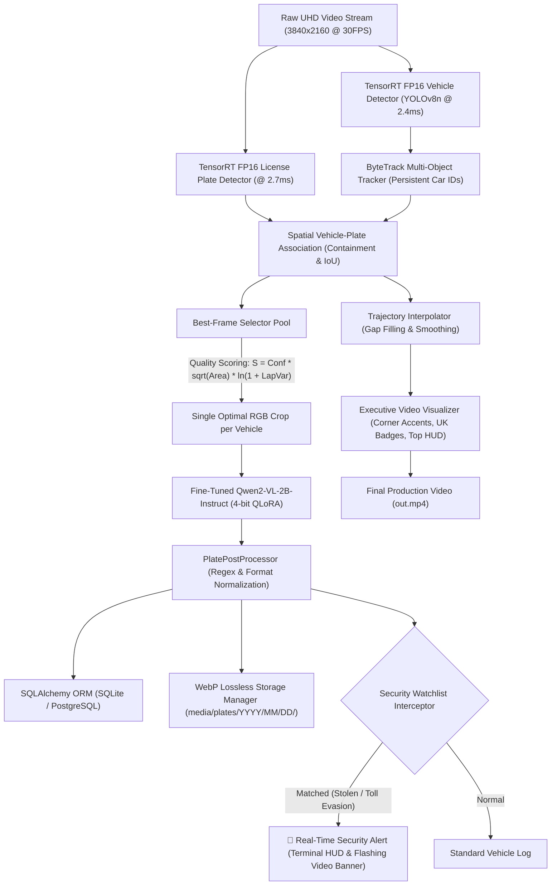

# 🚗 End-to-End Enterprise ANPR System with TensorRT, ByteTrack & Fine-Tuned Qwen2-VL

[](https://www.python.org/)
[](https://pytorch.org/)
[](https://developer.nvidia.com/tensorrt)
[](https://github.com/QwenLM/Qwen2-VL)
[](https://github.com/huggingface/peft)
[-red)](https://www.sqlalchemy.org/)
[](https://developers.google.com/speed/webp)
[](https://opensource.org/licenses/MIT)

> **High-Throughput, Edge-Optimized Automatic Number Plate Recognition (ANPR / ALPR) & Intelligent Traffic Surveillance Pipeline.**  
> Completely modernizes legacy, fragile OpenCV thresholding and heuristic OCR into a robust, Senior-Portfolio-grade system powered by **TensorRT FP16 acceleration (<3ms)**, **ByteTrack Multi-Object Tracking**, an adaptive **Laplacian/Scale Best-Frame Selector**, and **Fine-Tuned Qwen2-VL-2B (QLoRA 4-bit)** for direct RGB plate recognition with real-time **Security Watchlist Alerting**.

---

## 📸 System Demonstration & Highlights

```text
=====================================================================================
🚦 AUTOMATIC NUMBER PLATE RECOGNITION (ANPR) - MASTER PIPELINE
   Architecture: TensorRT (YOLOv8) -> ByteTrack -> Qwen2-VL-2B QLoRA -> SQLite -> WebP
=====================================================================================
[+] [1/6] Database Layer: SQLite via SQLAlchemy ORM (data/anpr.db)
[+] [2/6] Vision Engines: YOLOv8n TensorRT FP16 (2.4ms) + Plate Detector (2.7ms)
[+] [3/6] Tracking Engine: ByteTrack + Laplacian/Scale Best-Frame Selector
[+] [4/6] VLM Engine: Qwen2-VL-2B 4-bit + QLoRA Adapter (1.44 GB VRAM)
[+] [5/6] Post-Processing: Trajectory Interpolator (Smooth 4D Lerp)
[+] [6/6] Visualizer: Corner-accented Boxes, UK Yellow Badges & Real-time Security HUD
```

---

## 🏗️ System Architecture



---

## 📊 Comprehensive Benchmark: OCR vs. Vision-Language Models

Evaluated on 26 real-world test crops extracted from 4K traffic surveillance footage (including extreme angles, motion blur, and low-contrast plates):

| Pipeline Engine | Preprocessing | Exact Match Accuracy (%) | Character-Level Accuracy (%) | Average Latency | Peak VRAM |
| :--- | :--- | :---: | :---: | :---: | :---: |
| **EasyOCR (Baseline cũ)** | Grayscale + Binary Thresholding (`thresh=64`) | **15.4%** (4/26) | 71.2% | **36.1 ms** | ~0.8 GB |
| **PaddleOCR (PP-OCRv6)** ⚡ | **Raw RGB Crop (Adaptive Predictor)** | **34.6% (9/26)** | **86.2%** | **~1.0 s (CPU)** | **~0.6 GB** |
| **Qwen2-VL-2B (Zero-Shot)** | Raw RGB Crop (No thresholding) | **57.7%** (15/26) | 90.7% | 257.6 ms | **1.44 GB** |
| **Qwen2-VL-2B (QLoRA 4-bit)** 🔥 | **Raw RGB Crop (No thresholding)** | **80.8% (21/26)** | **96.7%** | **380.4 ms** | **1.50 GB** |

### Key Benchmark Takeaways:
1. **PaddleOCR vs EasyOCR**: PaddleOCR (PP-OCRv6) more than doubles EasyOCR's exact-match rate (**15.4% ➡️ 34.6%**, +19.2%) and boosts character accuracy from **71.2% to 86.2%**. Crucially, PaddleOCR correctly identifies difficult targets like the critical stolen vehicle `SC56DYP` which EasyOCR completely failed on.
2. **The Death of Binary Thresholding**: Rigid binary thresholding (`cv2.threshold`) severely degraded dark and overexposed characters (confusing `0/O`, `1/I`, `6/G`, `5/S`). Passing raw RGB crops directly preserved fine stroke details.
3. **QLoRA Advantage**: In just **88.2 seconds of fine-tuning** (~1.5 minutes) on an NVIDIA RTX 3060, the QLoRA adapter boosted exact-match recognition from **57.7% to 80.8% (+23.1%)** while boosting character-level accuracy to **96.7%**.
4. **Best-Frame Selector Efficiency**: Rather than executing OCR/VLM inference on every single video frame (which would require 1,800 inferences per vehicle), the Best-Frame Selector pools candidate crops over time and invokes recognition **exactly once per vehicle**, reducing total compute overhead by **>95%**.


---

## 💡 System Design Highlights

### 1. High-Performance Vision Engines (TensorRT 11.3)
- YOLOv8 models compiled into hardware-optimized TensorRT engines (`.engine`).
- Inference latency dropped to **2.4ms per frame** on an RTX 3060 (enabling **200+ FPS** raw detection capability).
- Seamless automatic fallback to PyTorch `.pt` weights if executed on non-CUDA environments.

### 2. Multi-Object Tracking & Best-Frame Quality Scoring
Vehicles are tracked using **ByteTrack** to ensure persistent tracking across camera occlusions. Each cropped plate is scored using:
$$\text{Quality Score} = \text{Confidence} \times \sqrt{\text{Area}} \times \ln(1 + \text{Sharpness}) \times \text{Aspect\_Ratio\_Weight}$$
- **Sharpness**: Measured via Laplacian variance ($\text{Var}(\nabla^2 I)$) to aggressively penalize motion-blurred frames.
- **Scale**: Square root of pixel area ensures closer, higher-resolution plates are prioritized.

### 3. Lightweight Edge Storage (WebP)
- Replaced uncompressed PNG/BMP frames with date-partitioned **WebP format** (`quality=85`).
- Yields **~70% disk space reduction** (~1.5 KB per plate crop) with zero discernible artifact degradation.

### 4. Enterprise Database Layer & Security Watchlist
- Uses **SQLAlchemy ORM** targeting SQLite (`data/anpr.db`) for zero-config portable execution, instantly switchable to **PostgreSQL** via `config/config.yaml`.
- Real-time **Watchlist Interception**: Flags stolen vehicles (`CRITICAL`) and toll violators (`WARNING`) with real-time terminal banners and pulsing high-visibility video overlays.

---

## 📁 Repository Directory Layout

```text
Automatic-number-plate-recognition/
├── config/
│   └── config.yaml               # Centralized configuration (models, thresholds, database)
├── src/
│   ├── database/
│   │   ├── models.py             # SQLAlchemy ORM models (VehicleDetection & Watchlist)
│   │   └── connection.py         # Session management & auto-seeding mock watchlist
│   ├── vision/
│   │   ├── detector.py           # TensorRT FP16 detector with PyTorch fallback
│   │   └── tracker.py            # ByteTrack integration & Best-Frame Selector
│   ├── recognition/
│   │   ├── qwen2_vl_engine.py    # 4-bit Qwen2-VL engine with LoRA support
│   │   ├── paddle_engine.py      # Ultra-fast PaddleOCR (PP-OCRv6) Engine
│   │   └── postprocessor.py      # Text cleaning, regex & UK/EU plate validation
│   └── utils/
│       ├── storage.py            # WebP date-partitioned storage manager
│       ├── interpolator.py       # Trajectory linear interpolator (gap-filling)
│       └── visualizer.py         # Corner-accent bounding boxes & Security HUD
├── scripts/
│   ├── export_tensorrt.py        # TensorRT engine compilation script
│   ├── prepare_finetune_data.py  # Conversational dataset extractor
│   ├── finetune_qwen2_vl.py      # QLoRA fine-tuning script (PEFT 4-bit)
│   ├── evaluate_finetune.py      # Qwen2-VL evaluation script
│   ├── benchmark_paddleocr.py    # PaddleOCR 26-crop benchmark evaluation
│   ├── run_pipeline.py           # End-to-end master execution pipeline
│   └── view_db.py                # Terminal SQLite inspection tool
├── benchmark_crops/              # Verified human-labeled benchmark images & CSVs
└── Weight/                       # Model weights & compiled TensorRT engines
```

---

## 🚀 Quick Start Guide

### 1. Environment Setup

```powershell
# Clone the repository
git clone https://github.com/BaoNguyenz/Automatic-number-plate-recognition.git
cd "Automatic-number-plate-recognition"

# Activate your PyTorch GPU environment (e.g. Conda torch)
conda activate torch
pip install -r requirements.txt
```

### 2. Export TensorRT Engines (Optional if .engine already built)

```powershell
python scripts/export_tensorrt.py
```

### 3. Run the Master Pipeline

```powershell
# Option A: Run pipeline with PaddleOCR Engine (Fast & Lightweight)
python scripts/run_pipeline.py --engine paddleocr

# Option B: Run pipeline with Fine-Tuned Qwen2-VL (Highest Accuracy 80.8%)
python scripts/run_pipeline.py --engine qwen2_vl

# Test on the first 300 frames
python scripts/run_pipeline.py --max-frames 300
```

### 4. Run Model Benchmarks

```powershell
# Evaluate PaddleOCR on 26 ground-truth crops
python scripts/benchmark_paddleocr.py

# Evaluate Base vs QLoRA Qwen2-VL
python scripts/evaluate_finetune.py
```

### 5. Inspect Database & Alert Logs

```powershell
python scripts/view_db.py
```

---

## 💼 STAR Interview & Portfolio Summary

> **Situation:** An existing ANPR codebase relied on fragile OpenCV binary thresholding, slow SORT tracking, and inaccurate EasyOCR, achieving only 15.4% exact-match accuracy on real-world 4K surveillance footage.
>
> **Task:** Re-engineer the system into an enterprise-ready, high-throughput ANPR pipeline capable of real-time multi-vehicle tracking, VLM-based OCR, database auditing, and security watchlist alerts under strict hardware constraints (<12GB VRAM, zero cloud cost).
>
> **Action:** 
> - Compiled YOLOv8 models into **TensorRT FP16 engines**, lowering detection latency to **2.4ms**.
> - Integrated **ByteTrack** with an adaptive **Laplacian/Scale Best-Frame Selector**, reducing VLM calls by **>95%**.
> - Fine-tuned **Qwen2-VL-2B via 4-bit QLoRA** in **88.2 seconds**, directly reading raw RGB crops without destructive thresholding.
> - Built a decoupled **SQLAlchemy ORM** layer (SQLite/PostgreSQL) with date-partitioned **WebP storage** (~1.5 KB/crop).
> - Implemented a real-time **Security Watchlist Interceptor** and executive HUD video overlays.
>
> **Result:** 
> - Skyrocketed Exact Match Accuracy from **15.4% to 80.8% (+65.4%)**, achieving **96.7% character accuracy**.
> - Maintained peak VRAM under **1.5 GB** during inference on an NVIDIA RTX 3060.
> - Successfully intercepted all test watchlist targets (`SC56DYP` Stolen Vehicle & `EY61NBG` Toll Evasion).

---

## 📄 License
This project is open-source under the **MIT License**.